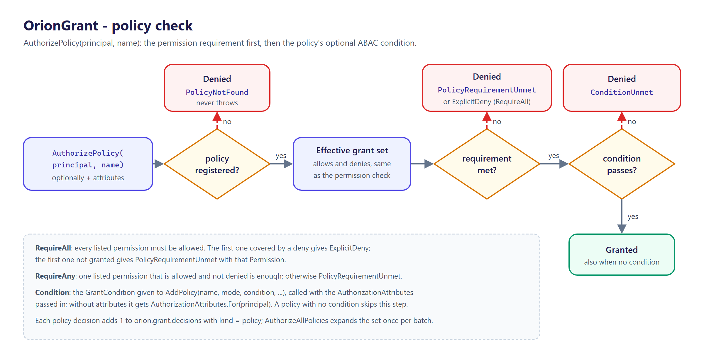

<p align="center">
  <picture>
    <source media="(prefers-color-scheme: dark)" srcset="docs/logo.png">
    
  </picture>
</p>

<h1 align="center">OrionGrant</h1>

<p align="center">
  Permission and policy authorization for .NET, with no framework dependency.
</p>

<p align="center">
  <a href="https://github.com/tunahanaliozturk/OrionGrant/actions/workflows/ci-cd.yml"></a>
  <a href="https://www.nuget.org/packages/OrionGrant/"></a>
  <a href="LICENSE"></a>
  
</p>

---

Define permissions as colon-scoped hierarchies with wildcards, group them into roles, and check
whether a principal is allowed an action, either by a single permission or by a named policy. The
matching rules are pure functions you can unit-test, and the library depends only on
`Microsoft.Extensions.DependencyInjection.Abstractions` and `Orion.Abstractions` (the family's
shared contracts spine, which supplies the `OrionInstrumentation` telemetry base).

Part of the **Orion** family. Pairs naturally with [OrionLedger](https://github.com/tunahanaliozturk/OrionLedger)
API-key scopes (feed the issued scopes straight into a principal's permissions), and works entirely
on its own.

![OrionGrant packages: ASP.NET Core endpoints reach OrionGrant through OrionGrant.AspNetCore and [Authorize]; other code injects IGrantAuthorizer from the core package](docs/diagrams/overview.png)

## Why

Most apps grow an ad-hoc tangle of `if (user.IsAdmin || user.Roles.Contains(...))`. OrionGrant
replaces that with a small, testable model:

- permissions like `orders:read`,
- wildcards like `orders:*`,
- roles that bundle permissions,
- and policies that combine requirements under a stable name.

The matcher and the authorizer are pure and synchronous, so authorization is allocation-light and
trivially unit-testable, and there is no external service to stand up.

## Features

- **Hierarchical permissions.** Colon-scoped strings (`orders:eu:write`) with wildcard matching:
  `*` matches one segment in the middle, or one-or-more segments when it is the last segment.
- **Roles, with role-to-role inclusion.** A role bundles permissions, and a role can include other
  roles so common bundles compose. A principal's effective set is its direct permissions unioned
  with the permissions of every role it holds (resolved transitively through inclusions). Unknown
  roles contribute nothing; inclusion cycles are rejected at registration.
- **Named policies.** `RequireAll` needs every listed permission; `RequireAny` needs at least one.
  Endpoints depend on the policy name, so you can change what it requires without touching call
  sites.
- **Explicit denies (deny-overrides).** `GrantPrincipal.Denies` carries permission patterns that
  override any matching allow, from a role or a direct grant.
- **Attribute-based conditions (ABAC).** A policy can carry a `GrantCondition` evaluated against the
  principal, resource and environment attributes, AND-ed with its permission requirement.
- **Opt-in effective-set cache.** `UseEffectiveSetCache` caches each principal's expanded grant set
  (bounded, least recently used out) so hot call sites do not re-expand roles on every check.
- **Structured denial reasons.** A denial carries a `DenialReason` (which permission, policy, mode,
  or resource was at fault) alongside the human-readable string, so callers branch on the cause
  rather than parsing prose.
- **Batch checks.** Evaluate several permissions or policies for one principal in one call,
  expanding the effective set once for the whole batch.
- **Resource / ownership-aware authorization.** Object-level checks where access is granted to the
  resource's owner OR to a principal holding a configured elevated permission. Holding `accounts:read`
  is necessary but not sufficient to read an account you do not own, which closes the IDOR gap.
- **A clear decision type.** Every check returns an `AuthorizationResult` carrying a granted flag
  and, on denial, a human-readable reason suitable for logging and a 403 body.
- **Telemetry built in.** A `System.Diagnostics.Metrics` meter counts every decision, tagged by
  outcome and kind.
- **ASP.NET Core integration.** The `OrionGrant.AspNetCore` companion package runs OrionGrant checks
  through the framework's `[Authorize]` pipeline.
- **No framework coupling.** Pure, synchronous, allocation-light. Multi-targets `net8.0`, `net9.0`,
  and `net10.0`.

See [docs/FEATURES.md](docs/FEATURES.md) for the full breakdown of the public surface, and
[docs/ROADMAP.md](docs/ROADMAP.md) for what is under consideration.

## Install

```bash
dotnet add package OrionGrant
```

For ASP.NET Core, the companion package bridges OrionGrant to the built-in `[Authorize]` pipeline:

```bash
dotnet add package OrionGrant.AspNetCore
```

It adds `AddOrionGrantAuthorization` plus `RequirePermission(...)` / `RequirePolicy(...)` extensions on `AuthorizationPolicyBuilder`, and an `IAuthorizationHandler` / policy-provider bridge, so an OrionGrant permission check is enforced through the standard `[Authorize]` pipeline. See [ASP.NET Core](#aspnet-core).

| Package | What it is |
|---------|------------|
| `OrionGrant` | `IGrantAuthorizer`, `GrantAuthorizer`, `GrantPrincipal`, `PermissionMatcher`, roles, policies, denial reasons, `GrantDiagnostics` and `AddOrionGrant`. Depends on `Microsoft.Extensions.DependencyInjection.Abstractions` and `Orion.Abstractions`. |
| `OrionGrant.AspNetCore` | `AddOrionGrantAuthorization`, `OrionGrantPolicyProvider`, `OrionGrantAuthorizationHandler`, `IGrantPrincipalResolver` and the `RequirePermission` / `RequirePolicy` extensions. Depends on `OrionGrant` and the `Microsoft.AspNetCore.App` shared framework. |

## Quick start

Register roles and policies once at startup:

```csharp
builder.Services.AddOrionGrant(grant => grant
    .AddRole("orders.manager", "orders:*")
    .AddRole("auditor", "orders:read", "billing:read")
    .AddPolicy("orders.write", PolicyMode.RequireAll, "orders:write")
    .AddPolicy("orders.touch", PolicyMode.RequireAny, "orders:read", "orders:write"));
```

Inject `IGrantAuthorizer` and check a permission or a policy:

```csharp
public sealed class OrderService(IGrantAuthorizer authorizer)
{
    public void Update(GrantPrincipal caller, Order order)
    {
        var decision = authorizer.AuthorizePolicy(caller, "orders.write");
        if (!decision.IsGranted)
        {
            // FailureReason says why, ready for a log line or a 403 body.
            throw new UnauthorizedAccessException(decision.FailureReason);
        }
        // ...
    }
}
```

A denial is a returned `AuthorizationResult`, never an exception from OrionGrant; what to do with it
(throw, return 403, log) is the caller's choice. In ASP.NET Core, let `[Authorize]` do it (see
[ASP.NET Core](#aspnet-core)).

A principal is just a subject plus the roles and direct permissions it carries (build it from your
API key, JWT claims, or session):

```csharp
var caller = new GrantPrincipal
{
    Subject = apiKey.Id,
    Roles = apiKey.Roles,
    Permissions = apiKey.Scopes,   // e.g. straight from OrionLedger
};
```

## Usage

### Permission matching

Permissions are colon-separated. A `*` segment matches one segment in the middle, or one-or-more
segments when it is last:

| Granted | Covers | Does not cover |
|---------|--------|----------------|
| `orders:read` | `orders:read` | `orders:write`, `orders:read:detail` |
| `orders:*` | `orders:read`, `orders:read:detail` | `orders`, `billing:read` |
| `orders:*:read` | `orders:eu:read` | `orders:eu:write` |
| `*` | everything | nothing |

The rules live in the static, pure `PermissionMatcher`, so you can use them directly without the DI
container or an authorizer:

```csharp
PermissionMatcher.IsGranted("orders:*", "orders:read");                 // true
PermissionMatcher.IsGrantedByAny(["billing:read", "orders:*"], "orders:write"); // true
```

`IGrantAuthorizer.Authorize` runs a permission check against the principal's effective set:


### Roles

A **role** bundles permissions. The authorizer expands every role a principal holds and unions the
results with the principal's direct permissions to get the effective set. Calling `AddRole` again
for the same name adds to that role's permission set rather than replacing it:

```csharp
builder.Services.AddOrionGrant(grant => grant
    .AddRole("support", "tickets:read")
    .AddRole("support", "tickets:comment"));   // support now grants both
```

You can inspect the effective set for a principal directly:

```csharp
IReadOnlySet<string> effective = authorizer.EffectivePermissions(caller);
```

A role can also **include** other roles, so common bundles compose instead of being repeated.
Inclusion is transitive and resolved once at registration; the effective set a principal gets from a
role already contains every permission reachable through its inclusions:

```csharp
builder.Services.AddOrionGrant(grant => grant
    .AddRole("reader", "orders:read")
    .AddRole("editor", "orders:write")
    .AddRole("admin",  "orders:delete")
    .IncludeRole("editor", "reader")    // editor now also grants orders:read
    .IncludeRole("admin",  "editor"));  // admin grants orders:delete, orders:write, orders:read
```

Inclusion edges that form a cycle (a role that includes itself directly or transitively) are
rejected when the registry is built, with a `RoleInclusionCycleException` naming the cycle, so a
misconfiguration fails fast at startup rather than looping during a request.

### Explicit denies

`GrantPrincipal.Denies` lists permission patterns the principal must not have, whatever its roles or
direct grants say. A deny uses the same wildcard matching as a grant and always wins
(deny-overrides):

```csharp
var contractor = new GrantPrincipal
{
    Subject = "u7",
    Roles = ["orders.manager"],          // grants orders:*
    Denies = ["orders:delete"],
};

authorizer.Authorize(contractor, "orders:read").IsGranted;     // true
authorizer.Authorize(contractor, "orders:delete").IsGranted;   // false - DenialKind.ExplicitDeny
```

`EffectivePermissions` still returns the allow set only; denies are applied when a check runs. A
deny also beats ownership and elevated grants in the resource-aware check.

### Policies: RequireAll and RequireAny

A **policy** is a named requirement evaluated against the principal's effective permissions:

- `PolicyMode.RequireAll` grants only when every listed permission is satisfied.
- `PolicyMode.RequireAny` grants when at least one is satisfied (it short-circuits on the first
  match).

```csharp
builder.Services.AddOrionGrant(grant => grant
    .AddPolicy("orders.manage", PolicyMode.RequireAll, "orders:read", "orders:write")
    .AddPolicy("orders.touch", PolicyMode.RequireAny, "orders:read", "orders:write"));

var manage = authorizer.AuthorizePolicy(caller, "orders.manage");
var touch  = authorizer.AuthorizePolicy(caller, "orders.touch");
```

Each listed permission is checked through the same wildcard matcher, so a principal holding
`orders:*` satisfies a policy that lists `orders:read` and `orders:write`. An unknown policy name is
denied with a reason rather than throwing.



### Attribute-based conditions (ABAC)

A policy can also carry a `GrantCondition`, a predicate over `AuthorizationAttributes` (the
principal, an optional `ResourceContext`, and an environment dictionary). The permission requirement
is checked first; the condition is an extra AND gate:

```csharp
builder.Services.AddOrionGrant(grant => grant
    .AddPolicy(
        "orders.edit-own",
        PolicyMode.RequireAll,
        attributes => attributes.Resource?.OwnerId == attributes.Principal.Subject
            && attributes.Env("region") == "eu",
        "orders:write"));

var attributes = new AuthorizationAttributes(
    caller,
    ResourceContext.OwnedBy("u1"),
    new Dictionary<string, string?> { ["region"] = "eu" });

var decision = authorizer.AuthorizePolicy(caller, "orders.edit-own", attributes);
```

A failed condition is denied with `DenialKind.ConditionUnmet`. Calling the two-argument
`AuthorizePolicy` on a policy with a condition evaluates it against
`AuthorizationAttributes.For(caller)` (the principal only, no resource, no environment).

### Resource and ownership-aware authorization

A permission check answers "may this principal read accounts?". It does not answer "may this
principal read *this* account?". Granting `accounts:read` to every caller and reading whatever id
arrives is the classic IDOR (Insecure Direct Object Reference) bug: one user reads another user's
row by changing a number in the URL.

The resource-aware overload closes that gap. The principal must hold the permission AND either own
the resource or hold a configured elevated grant. Holding the permission alone is necessary but not
sufficient:

```csharp
// account 42 is owned by u1; the owner id is what gets compared to the principal subject.
var account = new ResourceContext(ownerId: "u1", resourceType: "account", resourceId: "42");

var owner    = new GrantPrincipal { Subject = "u1", Permissions = ["accounts:read"] };
var stranger = new GrantPrincipal { Subject = "u2", Permissions = ["accounts:read"] };

authorizer.Authorize(owner,    "accounts:read", account).IsGranted;   // true  - holds it and owns it
authorizer.Authorize(stranger, "accounts:read", account).IsGranted;   // false - holds it but does not own it
```

`ResourceContext.OwnedBy("u1")` is a shorthand when only the owner identity matters. The optional
`resourceType` and `resourceId` are not used in the decision; they are carried for logging and
diagnostics so a denial can be traced to a concrete resource.

The "owner OR elevated" pattern lets privileged callers bypass ownership. Configure it per call with
`ResourceAuthorizationOptions`:

```csharp
var options = new ResourceAuthorizationOptions
{
    ElevatedPermissions = ["accounts:read:any"],   // any caller granted this bypasses ownership
};

var support = new GrantPrincipal { Subject = "svc-support", Permissions = ["accounts:read", "accounts:read:any"] };
authorizer.Authorize(support, "accounts:read", account, options).IsGranted;   // true - elevated bypass
```

Elevated permissions are matched through the same wildcard matcher as everything else.
`OwnerComparison` controls how the subject and owner id are compared (`StringComparison.Ordinal` by
default, matching the rest of the library). `TreatRootWildcardAsElevated` is on by default, so a
principal holding the root `*` grant bypasses ownership with no per-call configuration:

```csharp
var admin = new GrantPrincipal { Subject = "svc-admin", Permissions = ["*"] };
authorizer.Authorize(admin, "accounts:read", account).IsGranted;   // true - root bypasses ownership
```

The overload is a default interface method on `IGrantAuthorizer`, so existing implementors keep
compiling. Resource-aware decisions are recorded on the `orion.grant.decisions` counter with
`kind=resource`.

### Structured denial reasons

Every denial still carries a human-readable `FailureReason` for logging and a 403 body. A denial
also carries a structured `DenialReason` so a caller can branch on the cause instead of parsing the
string. `DenialReason.Kind` is one of `MissingPermission`, `PolicyNotFound`,
`PolicyRequirementUnmet`, `ResourceOwnership`, `ExplicitDeny`, or `ConditionUnmet`, and the relevant
identifiers are populated alongside it:

```csharp
var decision = authorizer.AuthorizePolicy(caller, "orders.manage");
if (!decision.IsGranted && decision.Denial is { } denial)
{
    switch (denial.Kind)
    {
        case DenialKind.PolicyNotFound:
            // denial.PolicyName is the unknown policy.
            break;
        case DenialKind.PolicyRequirementUnmet:
            // denial.PolicyName, denial.PolicyMode, and (for RequireAll) denial.Permission.
            break;
        case DenialKind.MissingPermission:
            // denial.Permission is the permission that was not granted.
            break;
        case DenialKind.ResourceOwnership:
            // denial.Permission was held; denial.ResourceType / denial.ResourceId echo the resource.
            break;
        case DenialKind.ExplicitDeny:
            // denial.Permission was required; denial.DenyPattern is the deny that blocked it.
            break;
        case DenialKind.ConditionUnmet:
            // denial.PolicyName is the policy whose ABAC condition returned false.
            break;
    }
}
```

The structured cause is additive: `FailureReason` is unchanged, and the back-compatible
`AuthorizationResult.Denied(string)` overload still produces a result with a null `Denial`.

### Batch checks

Check several permissions or policies for one principal in a single call. The authorizer expands the
principal's effective set once for the whole batch instead of once per requirement, and returns one
`BatchAuthorizationResult` per requirement in input order:

```csharp
IReadOnlyList<BatchAuthorizationResult> results = authorizer.AuthorizeAll(
    caller, ["orders:read", "orders:write", "billing:read"]);

foreach (var result in results)
{
    Console.WriteLine($"{result.Requirement}: {(result.IsGranted ? "granted" : "denied")}");
}

// Policies work the same way.
var policyResults = authorizer.AuthorizeAllPolicies(caller, ["orders.manage", "orders.touch"]);
```

Each item produces exactly the result the equivalent single call would, including its structured
denial, and records one decision on the meter, so a batch of N is equivalent to N single calls but
pays for the effective-set expansion only once. `AuthorizeAll` and `AuthorizeAllPolicies` are default
interface methods, so existing `IGrantAuthorizer` implementors keep compiling.

## Configuration

Everything is wired through `AddOrionGrant`. The `configure` callback is optional; calling
`AddOrionGrant()` with no arguments registers a working authorizer with no roles or policies
defined.

| Registered service | Lifetime | Notes |
|--------------------|----------|-------|
| `IGrantAuthorizer` | Singleton | The entry point for all checks. |
| `RoleRegistry` | Singleton | Immutable role-to-permissions map, built once from the builder. |
| `PolicyRegistry` | Singleton | Immutable name-to-policy map, built once from the builder. |
| `GrantDiagnostics` | Singleton | Owns the metrics meter; disposed with the container. |
| `IEffectiveGrantCache` | Singleton | Only when `UseEffectiveSetCache` is called. |

Registrations use `TryAdd`, so you can register your own implementation of any of these before
calling `AddOrionGrant` and it will be respected. Roles and policies are resolved once at
registration into immutable registries, so configuration is read at startup, not per request.

### Effective-set cache

By default every check expands the principal's roles again. A call site that checks the same
principal many times can turn on a bounded cache of expanded grant sets:

```csharp
builder.Services.AddOrionGrant(grant => grant
    .AddRole("orders.manager", "orders:*")
    .UseEffectiveSetCache(capacity: 4096));   // default capacity 1024
```

The cache key is the principal's role, permission and deny membership, and role contents are fixed
at startup, so a principal whose roles change gets a new key and never a stale decision. When the
cache is full the least recently used entry is evicted.

## ASP.NET Core

`OrionGrant.AspNetCore` registers OrionGrant and bridges it to the framework's authorization:

```csharp
builder.Services.AddOrionGrantAuthorization(grant => grant
    .AddRole("orders.manager", "orders:*")
    .AddPolicy("orders.write", PolicyMode.RequireAll, "orders:write"));

builder.Services.AddAuthorization(options =>
    options.AddPolicy("CanReadOrders", policy => policy.RequirePermission("orders:read")));

app.MapGet("/orders", () => "...").RequireAuthorization("CanReadOrders");
app.MapPut("/orders/{id}", (int id) => "...").RequireAuthorization("policy:orders.write");
```

`OrionGrantPolicyProvider` turns any policy name starting with `perm:` into a permission check and
`policy:` into an OrionGrant policy check, so `[Authorize(Policy = "perm:orders:read")]` works without
registering a policy per permission. Other names go to the framework's default provider. The
prefixes live in `OrionGrantPolicyNameOptions` (`PermissionPrefix`, `PolicyPrefix`).


The default `ClaimsGrantPrincipalResolver` builds the `GrantPrincipal` from claims, with claim types
from `OrionGrantClaimsOptions`:

| Option | Default | Read into |
|--------|---------|-----------|
| `SubjectClaimType` | `ClaimTypes.NameIdentifier`, then `sub` | `Subject` |
| `RoleClaimType` | `ClaimTypes.Role` | `Roles` |
| `PermissionClaimType` | `permission` | `Permissions` |
| `DenyClaimType` | `deny` | `Denies` |

An unauthenticated user, or one without a subject claim, is denied. Register your own
`IGrantPrincipalResolver` before `AddOrionGrantAuthorization` to load grants from somewhere else.

For object-level checks, pass an `OrionGrantResource` (or a bare `ResourceContext`) as the resource
to `IAuthorizationService.AuthorizeAsync(user, resource, requirement)`. Any other resource type is
denied (fail closed). A denial fails the context with an `OrionGrantAuthorizationFailureReason`
that carries the full `AuthorizationResult` and its `DenialReason`.

## Telemetry

`GrantDiagnostics` exposes a `System.Diagnostics.Metrics` meter named `Moongazing.OrionGrant`
(also available as `GrantDiagnostics.MeterName`). It publishes one counter:

- `orion.grant.decisions` (unit `{decision}`) tagged `orion.outcome` (`granted` / `denied`) and `kind`
  (`permission` / `policy` / `resource`).

`new GrantDiagnostics(instanceTag)` adds an `orion.instance` tag on the meter, so listeners can tell
several instances in one process apart.

Subscribe to it from OpenTelemetry like any other meter:

```csharp
builder.Services.AddOpenTelemetry()
    .WithMetrics(metrics => metrics.AddMeter(GrantDiagnostics.MeterName));
```

## Testing

The matcher and the authorizer are pure and synchronous, so unit tests need no mocks and no host.
Construct a `GrantAuthorizer` directly from its registries, or drive `PermissionMatcher` on its own:

```csharp
var policies = new PolicyRegistry(new Dictionary<string, AccessPolicy>
{
    ["orders.manage"] = new("orders.manage", PolicyMode.RequireAll, ["orders:read", "orders:write"]),
});

using var diagnostics = new GrantDiagnostics();
var authorizer = new GrantAuthorizer(RoleRegistry.Empty, policies, diagnostics);

var full = new GrantPrincipal { Subject = "u1", Permissions = ["orders:*"] };
Assert.True(authorizer.AuthorizePolicy(full, "orders.manage").IsGranted);
```

The repository's own test suite (xUnit) lives in `tests/`. There is also a BenchmarkDotNet suite in
`benchmarks/` covering the matcher, the authorizer, and the one-time registration path; see
[benchmarks.md](benchmarks.md). No measured numbers are committed; collect your own on the hardware
you care about.

## Versioning

OrionGrant follows [Semantic Versioning](https://semver.org/). The current line is `0.6.0`
(pre-1.0): the public API may still change between minor versions while the design settles. The
library multi-targets `net8.0`, `net9.0`, and `net10.0`, builds with `TreatWarningsAsErrors`,
nullable reference types enabled, and `latest-recommended` analyzers. See [CHANGELOG.md](CHANGELOG.md)
for release notes.

## Contributing

Issues and pull requests are welcome. Please read [CONTRIBUTING.md](CONTRIBUTING.md) and the
[Code of Conduct](CODE_OF_CONDUCT.md) before opening one.

## More from the Orion family

OrionGrant is one of a set of standalone .NET libraries:

- [OrionGuard](https://github.com/tunahanaliozturk/OrionGuard) - guard clauses and validation.
- [OrionLedger](https://github.com/tunahanaliozturk/OrionLedger) - API-key issuance and scopes.

## License

This project is licensed under the [MIT License](LICENSE).

## Author

**Tunahan Ali Ozturk** - [GitHub](https://github.com/tunahanaliozturk)
</content>
